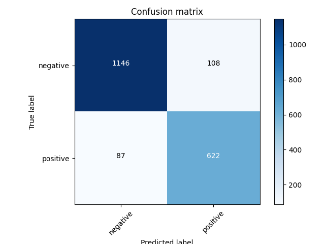
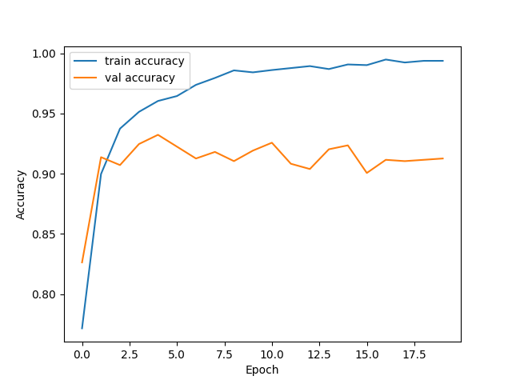
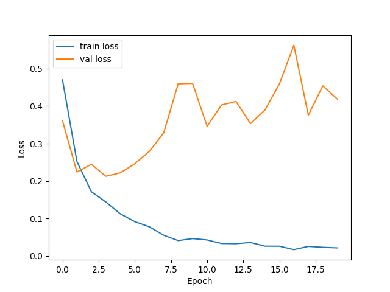

This project applies **LSTM-based sentiment analysis** to airline tweets.  
It classifies tweets as **positive** or **negative**.

---

## 📊 Dataset
- Source: [Twitter Airline Sentiment Dataset](https://www.kaggle.com/crowdflower/twitter-airline-sentiment)

---

## 🛠️ Approach
1. Preprocessing:
   - Removed neutral samples
   - Lowercased text
   - Removed special characters
   - Tokenized & padded sequences
   - Balanced classes by dropping excess negatives
2. Model:
   - Embedding layer (128 dims)
   - LSTM (196 units)
   - Dense layers with dropout
   - Softmax output (positive/negative)

---

## 📈 Results
- Test Accuracy: **0.9007**
- Test Loss: **0.5245**

### Confusion Matrix


### Training Curves
  


### Sample Predictions
See [`results/sample_predictions.csv`](results/sample_predictions.csv)

---

## 🚀 Usage

### 1. Train the model
```bash
python sentiment_analysis.py
```

Once the model is trained (or if you have `sentiment_model.h5` and `tokenizer.npy` saved),  
you can run inference interactively:

```bash
python sentiment_infer.py
```

